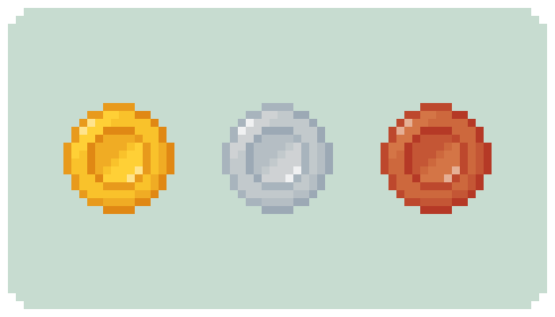

# Capstone Project: 
# COMMODITY RISK ASSESSMENT PREDICTOR AND RECOMMENDER [CRAPR]

  

CRAPR is a Machine-learning model that aims to address the lack of personalized commodity metals investment recommendations, particularly for investors seeking to diversify their portfolios. It provides foundational background on commodity metals (Gold, Silver and Copper) and Risk Portraits and through answering set of Questionnaire, investors would have clearer insights on their risk appetite and investment goals so as to make better informed investment decisions that suit their profile

 
